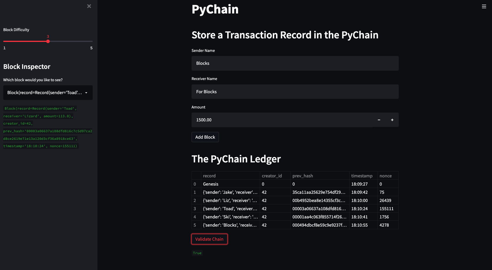

# UWFintech_Challenge_18
## Project Description
This project contains a simple blockchain application called PyChain. The application enables the user to create blocks of data, add them to the blockchain, view the blocks, and validate the blockchain in total.

## Technologies
**Python 3.7**  
**Pandas**  
**Streamlit**  

## Installation
Before running the application, install Python libraries Pandas and Streamlit.
```  
conda install pandas  
pip install streamlit  
```

## Usage
Navigate to the folder where the pychain.py file is saved. Run the following code to launch the web app:  
```streamlit run pychain.py```

### In-App Usage
1. Add block information (sender name, receiver name, amount) and select Add Block.
2. Set proof of work difficulty using the Block Difficulty slider.
3. View blocks using the Block Inspector and the PyChain Ledger.
4. Validate the entire blockchain by clicking "Validate Chain". If True, the entire chain is valid.


## Contributors
Jacob Vissering  
jake.vissering@gmail.com  
[LinkedIn](https://www.linkedin.com/in/jacobvissering/)

## License
MIT License
